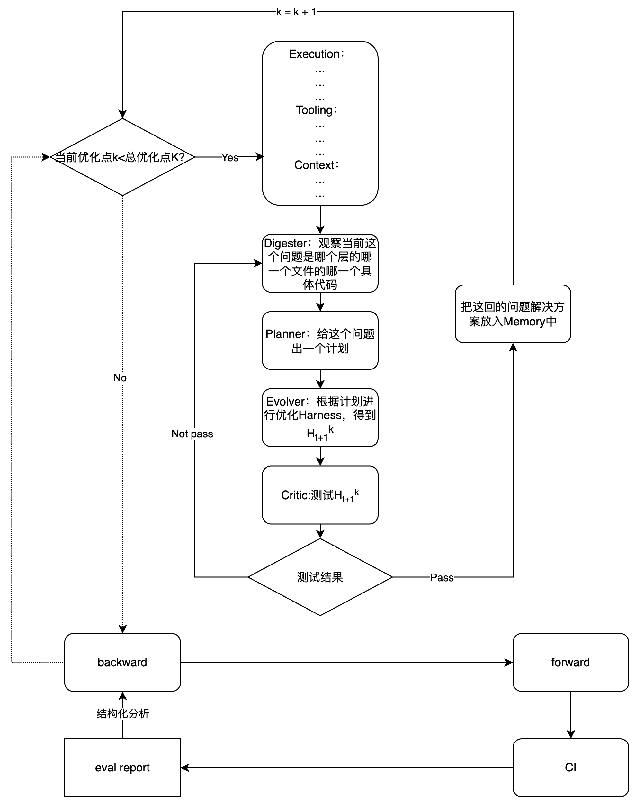

RSI架构设计

# 初步设计
## 优化对象
|子层|全称|核心问题|可以优化的内容|
|-|-|-|-|
|E|Execution|Agent 怎么运行？|execution loop、sandbox、retry、timeout、termination、fallback、parallelism|
|T|Tooling|Agent 能做什么？|tool schema、tool description、routing、tool selection、parameters、error handling|
|C|Context|模型当前看到什么？|system prompt、context construction、retrieval、compression、ordering、token allocation|
|S|State / Memory|跨步骤/跨任务记住什么？|short-term state、persistent memory、experience、state update、retrieval、forgetting|

## 优化指标
agent轨迹数据、正确性报告

## 优化架构

## 闭环说明
forward使用现有harness完成任务，CI进行测试，生成出来了eval report，包含了所有过程中的数据、轨迹、错误，然后backward根据这些东西进行现有harness的优化，然后继续forward

## Backward过程
1. 结构化分析和整理CI出来的eval report，明确存在的问题数量K和问题。
    1. 分析问题的层次：
        1. 答案正确性问题
        2. error
        3. 运行时间
        4. trajectory
        5. token

    2. K就是a中的问题数量

2. 开始进行K次优化，一个个完成问题的解决
    1. 当前解决第k个问题，首先确保k<K，如果不是直接到3，是就继续
    2. 首先完成整个harness系统的结构化配置处理，就是把每个文件归类到ETCSLOVG八个层之中，但是先只处理ETC这三层，另外五层我们先做统计后续给人工，不然全做有点复杂，目前方案只优化ETC这三个层+历史解决Memory（一共4个层）
    3. 第一个agent Digester观察当前问题是哪个层的哪个文件的哪个代码的问题
    4. 第二个agent Planner开始制定解决这个问题的方案，同时也会参考之前解决的Memory
    5. 第三个agent Evolver根据d给出的方案完成这个问题的解决，实现一次优化，得到$H_{t+1}^{k}$
    6. 第四个agent Critic测试$H_{t+1}^{k}$，如果未通过则还是使用$H_{t}$，说明优化有问题并返回c重新优化，通过了就继续并把最新的harness换为$H_{t+1}^k$
    7. 把这次的优化流程问题和解决方案放入Memory中，同时k = k + 1，返回a

3. 优化完成，继续forward

## 目前需要完成的问题
1. 明确好forward文件按E、T、C的严格归类，不是的话不用管，不在本次优化方案的优化对象中
2. 明确好CI返回的eval report的东西并处理好
3. 每次的harness版本都要保存起来，后续会根据Meta-Harness的思路进行优化