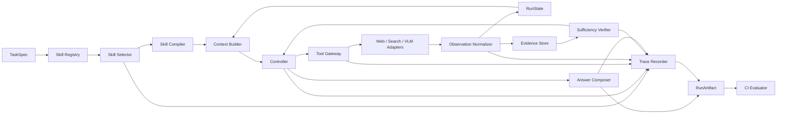

# V-GEMS Skill-Augmented Harness v1 设计

## 1. 目标与边界

本阶段只设计和实现稳定的 forward harness 及其 CI 接口，不实现 backward、自动修改代码或递归自我改进。

研究目标是回答：在模型、任务集和网页环境尽量固定的条件下，统一的 skill 选择、状态管理、证据管理和执行控制，是否能比现有 V-GEMS 以及“直接把 skill 文本放入上下文”的朴素方案获得更高的任务成功率和更好的成本效率。

v1 的范围限制如下：

- 只处理 Web 信息搜寻任务。
- 每次任务最多选择 1 个主 skill 和 1 个辅助 skill。
- skill 只提供可版本化的能力契约、过程指导和工具绑定，不允许任意修改 harness。
- 原子工具负责产生外部动作，skill 负责规定何时、为何以及如何组合这些工具。
- 所有运行都产生结构化状态、事件 trace、证据记录和最终 RunArtifact。
- 先完成行为等价重构，再加入 skill 机制；二者必须作为两个独立版本评测。

## 2. 当前 V-GEMS 的 harness 形态

当前实现已经包含 harness 的主要雏形：

| 当前能力 | 位置 | Harness 层 |
|---|---|---|
| ReAct 执行循环、重试、卡死检测、终止 | `src/agent.py` | E / L |
| 页面访问、URL 栈、计数器、理解度、VLM | `src/tools_for_eval.py` | T / S |
| Explorer、信息抽取、Critic 提示词 | `src/prompts.py` | C / V |
| 数据集运行、checkpoint、结果保存 | `src/evaluate_v_gems.py` | O / V |
| 页面抓取和文本清洗 | `src/utils.py` | T |

它目前更像“能运行的研究原型”，还不适合作为 skill 与 RSI 的稳定底座，原因主要有：

1. `WebWalker._run` 同时负责模型调用、动作解析、工具执行、状态更新、信息抽取、终止和回答生成，无法单独替换或评测某个策略。
2. 任务状态分散在 `self.momery`、局部变量和 `ROOT_URL.txt`、`nav_chain.json`、`count.txt`、`navigation_steps.txt` 等工作目录文件中，运行之间容易串扰，也无法安全并行。
3. 工具输出主要是自然语言，运行循环再通过正则提取 URL；错误、页面内容、按钮、截图和成本没有统一类型。
4. `app.py` 与 `tools_for_eval.py` 各自维护工具实现，消融实验又复制多套源代码，容易产生实现漂移。
5. memory 是无来源的字符串列表，没有 claim、URL、抓取时间、提取方式和去重键，无法做可靠的证据评测。
6. 完成条件存在冲突：Explorer 要求达到用户指定数量，Critic 却允许达到 50% 后结束；低预算终止、模型主动结束和 Critic 结束也没有统一优先级。
7. 结果文件只稳定记录最终答案、步数和异常，不能定位 skill 调用、获取、轨迹、证据或终止阶段的失败。
8. 评测脚本中存在硬编码凭据，配置、密钥和实验元数据没有分离。凭据需要从历史和远端提交中移除并轮换。

因此，v1 的第一项工作不是加入更多 prompt，而是建立一个单一状态源和清晰的模块边界。

## 3. 目标架构



其中 Controller 只实现状态机和策略调度，不直接处理网页、不持久化临时文件，也不直接拼接大段提示词。所有模块围绕 `RunContext` 工作。

## 4. 核心数据契约

### 4.1 TaskSpec

```python
@dataclass(frozen=True)
class TaskSpec:
    task_id: str
    query: str
    root_url: str | None
    task_type: str
    language: str
    constraints: dict
    expected_count: int | None
    budget: "Budget"
```

`expected_count` 在任务进入执行循环前解析一次，之后所有计数和终止逻辑使用同一个值。

### 4.2 SkillSpec

每个 skill 目录包含：

```text
skills/<skill_id>/
  SKILL.md
  skill.json
  fixtures/          # 可选
  adapter.py         # 只有 tool-backed skill 才允许存在
```

`skill.json` 是机器可读契约，最小字段为：

```json
{
  "id": "general-web-search",
  "version": "1.0.0",
  "mode": "instruction|tool-backed|workflow",
  "task_types": ["fact_lookup", "multi_source"],
  "activation": {
    "positive": ["需要当前或可核验的外部信息"],
    "negative": ["答案已完整包含在用户提供的材料中"]
  },
  "required_tools": ["search", "fetch"],
  "optional_tools": ["browser", "vlm"],
  "input_contract": {},
  "output_contract": {},
  "evidence_policy": {},
  "budget_defaults": {},
  "failure_modes": [],
  "fallbacks": [],
  "entrypoint": null
}
```

外部收集到的 skill 不能直接进入运行时。导入时先经过 manifest 生成、schema 校验、工具权限检查和小型 fixture 测试，再进入 registry。

### 4.3 ToolCall 与 ToolResult

```python
@dataclass(frozen=True)
class ToolCall:
    call_id: str
    tool_name: str
    arguments: dict
    skill_id: str | None
    purpose: str

@dataclass(frozen=True)
class ToolResult:
    call_id: str
    status: str               # ok, timeout, blocked, invalid, partial, error
    final_url: str | None
    content: str | None
    links: list[dict]
    screenshot_ref: str | None
    provenance: dict
    latency_ms: int
    cost: dict
    error: dict | None
```

Controller 不再解析类似 `The url now is ...` 的自然语言；页面适配器直接返回 `final_url`。

### 4.4 EvidenceRecord

```python
@dataclass(frozen=True)
class EvidenceRecord:
    evidence_id: str
    claim: str
    content: str
    source_url: str
    acquired_at: str
    acquisition_method: str
    location: dict | None
    skill_id: str | None
    support_status: str
    dedup_key: str
```

导航提示、候选链接和能支持最终答案的证据必须分开。只有 `support_status=verified` 的记录可以进入最终答案生成上下文。

### 4.5 RunState

```python
@dataclass
class RunState:
    task: TaskSpec
    selected_skills: list[str]
    current_url: str | None
    navigation_stack: list[str]
    frontier: list[dict]
    visited_urls: set[str]
    open_gaps: list[str]
    evidence_ids: list[str]
    failures: list[dict]
    budget_used: dict
    stalled_steps: int
    termination: dict | None
```

`RunState` 是一次运行的唯一状态源。默认保存在内存中，同时按事件增量写入独立的 `runs/<run_id>/`，不再使用共享的根目录临时文件。

## 5. 模块与接口

### 5.1 Skill Registry

职责：加载、校验、索引和版本化 skill，不决定最终选择。

```python
class SkillRegistry(Protocol):
    def search(self, task: TaskSpec, limit: int = 5) -> list[SkillCandidate]: ...
    def get(self, skill_id: str, version: str | None = None) -> SkillSpec: ...
```

v1 可以使用 task type、关键词和 manifest 字段做可解释检索，不必先训练 skill retriever。每次返回候选得分和命中字段。

### 5.2 Skill Selector

职责：从最多 5 个候选中选择 1 个主 skill 和至多 1 个辅助 skill，也可以明确选择空集合。

```python
class SkillSelector(Protocol):
    def select(
        self, task: TaskSpec, candidates: list[SkillCandidate]
    ) -> SkillSelection: ...
```

`SkillSelection` 必须记录 `selected`、`rejected`、结构化理由、预计工具和预算。选择阶段单独计分，不能用最终答案正确来反推“选择正确”。

### 5.3 Skill Compiler 与 Context Builder

职责：把选中 skill 编译成受预算限制的执行上下文，而不是把完整 skill 库全部塞进 prompt。

上下文固定为五个区块：

1. Task：用户问题、范围和数量要求。
2. Policy：跨 skill 的固定安全、证据和预算规则。
3. Selected Skills：选中 skill 的相关步骤、工具约束和失败处理。
4. State：已访问页面、开放缺口、剩余预算和最近失败。
5. Evidence：去重后的可引用证据摘要。

```python
class ContextBuilder(Protocol):
    def build(self, ctx: RunContext, phase: str) -> ModelInput: ...
```

prompt 模板和 skill 内容分别版本化，并记录最终注入模型的内容哈希和 token 数。

### 5.4 Controller

职责：实现统一状态机：

```text
INIT -> SELECT_SKILL -> PLAN -> ACT -> OBSERVE -> VERIFY
                                  ^                  |
                                  |---- CONTINUE ----|
                                                     |
                          ANSWER / PARTIAL / ABSTAIN / FAILED
```

Controller 的每个循环只能做一次状态转换。模型可以建议动作，但下面的决定由 harness 确定执行：参数是否合法、工具是否允许、预算是否足够、是否重复访问、是否触发 fallback、是否终止。

终止优先级固定为：

1. 已满足结构化完成条件，生成答案。
2. 遇到不可恢复的权限或访问错误，输出 partial 或 abstain。
3. 预算不足以执行下一动作，输出 partial 或 abstain。
4. 连续无信息增益或重复动作达到阈值，执行一次恢复；恢复次数耗尽后结束。
5. 其余情况继续执行。

对于“要求 N 项”的任务，默认只有 `verified_unique_count >= N` 才算完整成功。达到 50% 或 80% 只能产生 `partial`，不能标记为完整成功。

### 5.5 Tool Gateway

职责：统一工具发现、参数校验、权限、超时、重试、错误分类和成本记录。

```python
class ToolGateway(Protocol):
    async def execute(self, call: ToolCall, ctx: RunContext) -> ToolResult: ...
```

v1 保留现有能力，但收敛为四类工具：

- `browser.navigate`：访问 URL 或已发现链接。
- `browser.back`：由 RunState 的导航栈执行。
- `page.extract`：提取正文、链接和结构信息。
- `vision.inspect`：满足视觉触发条件时分析当前截图。

`count_usefulness` 和 `query_requirement` 不再暴露给模型，它们属于 RunState；`calculate_understanding_score` 可以保留为 harness 内部路由器，不必消耗一次 agent 动作。

错误统一为：`invalid_input`、`timeout`、`rate_limited`、`auth_required`、`blocked`、`not_found`、`render_failed`、`extract_failed`、`provider_error`。不同错误对应固定的重试或 fallback，不能都退化成空结果。

### 5.6 Observation Normalizer 与 Evidence Store

职责：把 ToolResult 分成页面观察、候选链接、错误和证据；保留来源后再压缩上下文。

Evidence Store 提供：

```python
class EvidenceStore(Protocol):
    def add(self, records: list[EvidenceRecord]) -> list[str]: ...
    def verified(self, task_id: str) -> list[EvidenceRecord]: ...
    def coverage(self, requirements: list[str]) -> CoverageReport: ...
```

去重优先使用规范化 URL、标题和内容哈希，语义去重只作补充。信息抽取器不得把“可能需要点击的链接”记成已验证答案。

### 5.7 Sufficiency Verifier 与 Answer Composer

Verifier 只返回结构化判定：

```python
class VerificationResult:
    status: str              # sufficient, insufficient, partial, conflict
    covered_requirements: list[str]
    missing_requirements: list[str]
    unsupported_claims: list[str]
    verified_unique_count: int
```

Answer Composer 只能读取通过 verifier 的证据，输出答案、引用映射和完成状态。这样能把“是否继续搜”和“如何措辞回答”分开。

### 5.8 Trace Recorder

每次状态转换记录一个事件，不保存模型的私有思维过程，只保存任务所需的短理由和可观察行为：

```json
{
  "event_id": "...",
  "run_id": "...",
  "step": 7,
  "event_type": "skill_selected|model_called|tool_called|observation|evidence_added|verified|terminated",
  "component": "selector|controller|tool_gateway|verifier",
  "skill": {"id": "...", "version": "..."},
  "input_ref": "sha256:...",
  "status": "ok",
  "latency_ms": 123,
  "cost": {},
  "state_delta": {},
  "error": null
}
```

## 6. 建议代码结构

```text
src/vgems_harness/
  types.py
  config.py
  runtime.py
  controller.py
  context.py
  skills/
    manifest.py
    registry.py
    selector.py
    compiler.py
  tools/
    gateway.py
    browser.py
    extractor.py
    vision.py
  state/
    run_state.py
    evidence.py
  verification/
    sufficiency.py
    answer.py
  observability/
    trace.py
    artifacts.py
  evaluation/
    runner.py
    report.py
    compare.py
configs/
  harness/
  experiments/
skills/
tests/fixtures/
runs/
```

Streamlit 与离线评测共用同一个 `HarnessRuntime.run(TaskSpec)`，UI 只消费事件流，不能再各自实现工具。

消融实验通过配置开关完成，例如 `skills.enabled=false`、`vision.enabled=false`、`navigation_stack.enabled=false`，不再复制整个源代码目录。

## 7. 可修改对象与冻结对象

本阶段所有修改由研究者完成并明确版本化。为了后续 RSI 和当前实验可归因，先定义边界：

| 类别 | v1 可修改对象 | 说明 |
|---|---|---|
| E | retry、timeout、fallback、stall、termination、预算分配 | 只能通过有界配置或独立策略模块修改 |
| T | skill manifest、skill selector、tool schema、adapter mapping | 原始工具实现变更要单独记版本 |
| C | prompt 模板、skill 编译规则、上下文顺序、压缩和 token 预算 | 记录最终 context 哈希 |
| S | frontier、visited、gap、evidence 的更新与检索策略 | 数据 schema 本身冻结 |
| L | Controller 状态转换 | v1 人工修改，RSI 阶段暂不自动改 |
| O | trace 采集实现 | 冻结，不能通过少记录失败获得更好指标 |
| V | evaluator、数据划分、评分和门禁 | 在正式实验前冻结 |
| G | 域名、权限、密钥和动作上限 | 硬约束，不允许 skill 覆盖 |

后续 RSI 若按现有方案只优化 E、T、C 和历史 Memory，可以直接把这些模块列入允许修改清单，同时将 O、V、G 和独立测试集设为不可修改边界。

## 8. RunArtifact 与 CI 输出

每个运行生成：

```text
runs/<experiment_id>/<run_id>/
  manifest.json
  task.json
  selected_skills.json
  trace.jsonl
  evidence.jsonl
  answer.json
  metrics.json
  errors.jsonl
```

`manifest.json` 必须记录 harness 版本、skill catalog 版本、模型和参数、数据集版本、网页模式、地区、时间、预算和 evaluator 版本。

聚合 `eval_report.json` 至少包含：

- invocation：是否应调用 skill、选择是否正确、参数是否合法。
- acquisition：页面成功率、提取成功率、VLM 触发与成功率。
- trajectory：工具调用数、重复率、恢复率、每次调用的有效证据、提前或过度终止。
- evidence：证据召回、来源完整性、重复和冲突、unsupported claim 数。
- answer：正确率、完整率、partial 和 abstain 比例。
- system：崩溃率、延迟、token、工具调用、VLM 调用和预算违规。
- regressions：基线正确但候选版本错误的任务列表及失败层级。

失败分类固定为：

```text
invocation.missed | invocation.wrong_skill | invocation.invalid_args
acquisition.timeout | acquisition.blocked | acquisition.render | acquisition.extract
trajectory.loop | trajectory.drift | trajectory.no_gain | trajectory.premature_stop | trajectory.budget
evidence.missing | evidence.duplicate | evidence.unsupported | evidence.conflict
answer.incorrect | answer.incomplete | answer.fabricated
system.crash | system.config | system.secret | system.unknown
```

## 9. CI 分层与验收门禁

### CI-0：静态与契约检查

每次提交运行，速度应控制在分钟级：

- 所有 harness config、SkillSpec、ToolResult 和 RunArtifact 通过 schema 校验。
- prompt 模板可完整渲染，无缺失变量。
- skill 声明的工具真实存在，参数和权限匹配。
- 无硬编码 API key、token、cookie 或私密路径。
- production、evaluation 和 UI 使用同一工具实现。

硬门禁：任一项失败则拒绝候选版本。

### CI-1：离线单元与状态转换

使用固定 fixture 检查：

- URL 规范化、同域限制、去重、预算扣减和错误映射。
- N 项任务不会在少于 N 条已验证证据时报告完整成功。
- timeout、blocked、空页面、重复页面和 VLM 失败进入正确恢复路径。
- 每个状态转换都产生 trace，终止后不能继续调用工具。

硬门禁：零未捕获异常、零预算违规、零缺失终止原因。

### CI-2：冻结轨迹 replay

固定模型输出和工具返回，回放典型成功与失败轨迹。它用于验证重构前后的动作解析、状态更新、恢复和终止语义，不宣称代表 live Web 性能。

硬门禁：关键状态和最终完成类型与 golden fixture 一致；证据来源不得丢失。

### CI-3：小规模 live smoke

从语言、领域、single/multi-source 和难度中分层抽取少量任务。对网络波动类失败允许有界重跑，但每次结果均保留。

硬门禁：无系统性崩溃、无密钥泄露、无越权访问、无预算违规。质量和成本只作为候选筛选，不单次决定结论。

### CI-4：版本对比评测

在冻结 validation 集上对 baseline 与 candidate 做逐题配对比较。建议预先冻结以下初始门槛，再根据一次 pilot 的方差校准：

- 总体正确率不低于 baseline，并达到预先声明的最小实际增益目标。
- 目标任务切片有正增益。
- Regression Rate 不超过 3%。
- 崩溃率和 unsupported claim rate 不高于 baseline。
- 平均 token、工具调用和墙钟时间的任一增长不超过 20%，除非质量进入预先声明的 Pareto 改进区间。
- 预算违规为 0。

正式论文结果在独立 held-out test 上只运行冻结后的最终版本，不能用 test 结果继续调参。

## 10. 实验条件

至少保留以下版本，避免把重构收益、skill 收益和额外预算混在一起：

| 条件 | 含义 | 用途 |
|---|---|---|
| H0 | 当前 V-GEMS | 历史基线 |
| H1 | 新模块化 harness，skills 关闭 | 验证行为等价重构 |
| H2 | 检索到 skill 后直接注入原始文本 | 朴素 skill 基线 |
| H3 | Registry + Selector + Compiler | 测量受控 skill 选择与上下文构造 |
| H4 | H3 + RunState + Evidence + Verifier | 完整强化 harness |

H3/H4 再做以下消融：移除 selector、移除 skill compiler、移除 gap state、移除证据 verifier、移除 fallback。所有条件使用相同模型、最大预算、数据划分和 evaluator。

主结果同时报告 accuracy、Regression Rate、partial/abstain、有效证据/工具调用、token、延迟和方差，不能只报告最终正确率。

## 11. 实施顺序

### Phase 0：冻结基线

- 固定当前 H0 的代码快照、模型配置、评测器和已有 680 条结果。
- 轮换并移除仓库历史中暴露的凭据。
- 选出 validation、held-out test 和小型 live smoke 切片。

### Phase 1：行为等价重构

- 建立数据类型、RunState、ToolResult、Controller 和 Trace Recorder。
- 合并 UI 与 evaluation 工具实现。
- 用配置代替消融目录复制。
- 完成 H1，对比 H0。

### Phase 2：Skill Runtime

- 定义 SkillSpec 和导入校验器。
- 先接入 8 到 15 个覆盖搜索、获取、浏览、视觉和多源核验的代表性 skill。
- 实现 Registry、Selector 和 Compiler，得到 H2/H3。

### Phase 3：证据与终止

- 实现 EvidenceRecord、coverage、去重、Verifier 和统一终止策略，得到 H4。
- 输出完整 RunArtifact 和 eval_report。

### Phase 4：CI 与论文实验

- 固化 CI-0 到 CI-4。
- 跑主实验、组件消融、模型迁移和成本分析。
- H4 冻结后，才开始对接后续 backward/RSI。

## 12. v1 完成标准

满足以下条件才认为强化 harness 已完成：

1. Streamlit 与离线评测调用同一个 Runtime 和同一套工具。
2. 两个任务可以并行执行且状态不会串扰。
3. 所有工具结果、证据、skill 选择和终止原因都有结构化记录。
4. H0、H1、H2、H3、H4 可以通过配置复现，不需要复制源代码。
5. CI 可以指出候选版本改坏了哪些任务、失败发生在哪一层、付出了多少额外成本。
6. 独立 held-out test 在正式实验前保持不可见。
7. backward/RSI 可以只通过 RunArtifact 和 eval_report 获取输入，无需解析控制台日志。

